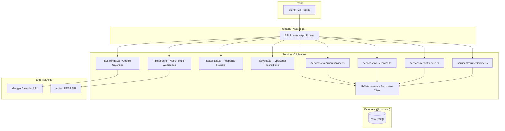

# Personal Time Observatory — Project Status Report

**Date:** 2026-03-14  
**Phase:** Backend MVP Complete

---

## 🏗️ Architecture Overview



---

## 📊 Database Schema — 10 Tables

| Table | Purpose | Rows/Indexes |
|-------|---------|-------------|
| `activities` | The Universal Event Container — time-bound actions | 3 indexes |
| `activity_sources`| Linking table mapping an activity to one or more external sources | 1 index |
| `execution_logs` | Records whether planned blocks were executed | 2 indexes |
| `focus_sessions` | Pomodoro-style timed sessions | 2 indexes |
| `routine_definitions` | Structured routine templates | — |
| `routine_steps` | Individual timed steps within routines | 1 index |
| `routine_runs` | Records each run of a routine | 2 indexes |
| `oauth_tokens` | Google OAuth access/refresh tokens | — |
| `notion_sources` | Registered Notion databases with per-source API keys | 1 index |
| `notion_items` | Synced Notion pages with full JSONB properties | 3 indexes |

**Total indexes:** 15  
**SQL migration files:** 5 (incl. `upgrade_activities.sql`)

---

## 🔌 API Endpoints — 8 Route Groups, 20+ Endpoints

### Infrastructure
| Method | Endpoint | Status |
|--------|----------|--------|
| [GET](file:///d:/git_repos/my_repos/anchor/frontend/app/api/execution/route.ts#36-58) | `/api/health` | ✅ Working |

### Google Calendar (OAuth2)
| Method | Endpoint | Status |
|--------|----------|--------|
| [GET](file:///d:/git_repos/my_repos/anchor/frontend/app/api/execution/route.ts#36-58) | `/api/auth/google` | ✅ Redirects to consent screen |
| [GET](file:///d:/git_repos/my_repos/anchor/frontend/app/api/execution/route.ts#36-58) | `/api/auth/google/callback` | ✅ Exchanges code → tokens |
| [GET](file:///d:/git_repos/my_repos/anchor/frontend/app/api/execution/route.ts#36-58) | `/api/auth/google/status` | ✅ Connection check |
| [GET](file:///d:/git_repos/my_repos/anchor/frontend/app/api/execution/route.ts#36-58) | `/api/calendar?start=&end=` | ✅ Syncs events → activities |

### Notion (Multi-Workspace)
| Method | Endpoint | Status |
|--------|----------|--------|
| [GET](file:///d:/git_repos/my_repos/anchor/frontend/app/api/execution/route.ts#36-58) | `/api/notion/status` | ✅ Config check |
| [GET](file:///d:/git_repos/my_repos/anchor/frontend/app/api/execution/route.ts#36-58) | `/api/notion/sources` | ✅ List registered DBs |
| [POST](file:///d:/git_repos/my_repos/anchor/frontend/app/api/focus/route.ts#9-47) | `/api/notion/sources` | ✅ Register DB + validate |
| [DELETE](file:///d:/git_repos/my_repos/anchor/frontend/app/api/notion/sources/route.ts#43-65) | `/api/notion/sources` | ✅ Remove source + items |
| [POST](file:///d:/git_repos/my_repos/anchor/frontend/app/api/focus/route.ts#9-47) | `/api/notion/sync` | ✅ Paginated sync |
| [GET](file:///d:/git_repos/my_repos/anchor/frontend/app/api/execution/route.ts#36-58) | `/api/notion/items` | ✅ List with source filter |
| [PATCH](file:///d:/git_repos/my_repos/anchor/frontend/app/api/notion/items/route.ts#24-46) | `/api/notion/items` | ✅ Two-way sync to Notion |
| [DELETE](file:///d:/git_repos/my_repos/anchor/frontend/app/api/notion/sources/route.ts#43-65) | `/api/notion/items` | ✅ Soft-delete + optional Notion archive |

### Execution Tracking & Activities (Universal Event Container)
| Method | Endpoint | Status |
|--------|----------|--------|
| `GET` | `/api/activities` | ✅ List activities / Time Blocks |
| `POST` | `/api/activities` | ✅ Create manual activity |
| `POST` | `/api/activities/from-notion` | ✅ Convert Notion item to activity |
| `POST` | `/api/activities/from-email` | ✅ Convert Gmail item to activity |
| `POST` | `/api/execution` | ✅ Record log |
| `GET` | `/api/execution?date=` | ✅ Fetch by date |

### Focus Sessions
| Method | Endpoint | Status |
|--------|----------|--------|
| [POST](file:///d:/git_repos/my_repos/anchor/frontend/app/api/focus/route.ts#9-47) | `/api/focus` (start/stop) | ✅ Timer management |
| [GET](file:///d:/git_repos/my_repos/anchor/frontend/app/api/execution/route.ts#36-58) | `/api/focus?activity_id=` | ✅ Fetch by activity |

### Reports
| Method | Endpoint | Status |
|--------|----------|--------|
| [GET](file:///d:/git_repos/my_repos/anchor/frontend/app/api/execution/route.ts#36-58) | `/api/reports?type=weekly` | ✅ Weekly summary |
| [GET](file:///d:/git_repos/my_repos/anchor/frontend/app/api/execution/route.ts#36-58) | `/api/reports?type=habits` | ✅ Habit adherence |

### Routines
| Method | Endpoint | Status |
|--------|----------|--------|
| [GET](file:///d:/git_repos/my_repos/anchor/frontend/app/api/execution/route.ts#36-58) | `/api/routines` | ✅ List with steps |
| [POST](file:///d:/git_repos/my_repos/anchor/frontend/app/api/focus/route.ts#9-47) | `/api/routines` (create/start/step-complete) | ✅ Full lifecycle |

---

## 📁 File Structure

```
anchor/
├── frontend/
│   ├── app/api/
│   │   ├── auth/google/          # OAuth flow (3 routes)
│   │   ├── calendar/             # Google Calendar sync
│   │   ├── execution/            # Execution tracking
│   │   ├── focus/                # Focus sessions
│   │   ├── health/               # Health check
│   │   ├── notion/               # Notion integration (4 routes)
│   │   ├── reports/              # Weekly + habit reports
│   │   └── routines/             # Routine management
│   ├── lib/
│   │   ├── api-utils.ts          # successResponse / errorResponse
│   │   ├── calendar.ts           # Google OAuth + Calendar helpers
│   │   ├── database.ts           # Supabase client
│   │   ├── notion.ts             # Notion multi-workspace service
│   │   └── types.ts              # Shared TypeScript interfaces
│   ├── services/
│   │   ├── executionService.ts   # Execution log CRUD
│   │   ├── focusService.ts       # Focus session CRUD
│   │   ├── reportService.ts      # Report generation
│   │   └── routineService.ts     # Routine lifecycle
│   ├── database/
│   │   ├── schema.sql            # Core 6 tables
│   │   ├── add_oauth_tokens.sql  # Google tokens
│   │   ├── add_notion_tables.sql # Notion sources + items
│   │   └── add_notion_api_key.sql# Multi-workspace support
│   └── .env.local                # All secrets
├── bruno_routes/                 # 23 test routes
└── project_context.md            # Project spec
```

---

## 🧪 Test Coverage

**27 Bruno routes** covering every endpoint. All tested and verified working.

---

## 📈 Progress Rating

| Area | Rating | Notes |
|------|--------|-------|
| **Backend Architecture** | ⭐⭐⭐⭐⭐ | Clean separation of routes/services/lib |
| **Database Design** | ⭐⭐⭐⭐ | Solid schema, good indexes. Minor: no RLS |
| **Google Calendar** | ⭐⭐⭐⭐⭐ | Full OAuth2, auto token refresh, event sync |
| **Notion Integration** | ⭐⭐⭐⭐⭐ | Multi-workspace, JSONB properties, two-way sync |
| **API Consistency** | ⭐⭐⭐⭐⭐ | Unified `{ success, data/error }` format everywhere |
| **Error Handling** | ⭐⭐⭐⭐ | Good, but missing input sanitization |
| **Testing** | ⭐⭐⭐⭐ | Manual Bruno coverage, no automated tests |
| **Security** | ⭐⭐⭐ | Single-user, but API keys stored in plaintext |
| **Frontend** | ⭐ | Not started (by design — backend-first) |

**Overall: 4.2 / 5** — Excellent backend foundation, ready for frontend and refinement.

---

## 🔍 Code Review — Loopholes & Risks

### 🔴 Critical

**1. API keys stored as plaintext in Supabase**
- `notion_sources.api_key` and `oauth_tokens.access_token` are stored unencrypted
- **Risk:** If Supabase DB is compromised, all integration tokens are exposed
- **Fix:** Encrypt at rest using AES-256 with a server-side key, or use Supabase Vault

**2. No authentication on API routes**
- All routes are completely open — anyone who knows the URL can call them
- **Risk:** Low for localhost, high if deployed
- **Fix:** Add a simple API key middleware or Supabase Auth check before deployment

### 🟡 Medium

**3. No rate limiting on sync endpoints**
- `/api/notion/sync` and `/api/calendar` can be called repeatedly without throttling
- **Risk:** Could burn through Notion's 3 req/sec limit or Google's quota
- **Fix:** Add a minimum interval check using `last_synced_at`

**4. Notion sync is sequential (N+1 queries)**
- Each page in [syncSource()](file:///d:/git_repos/my_repos/anchor/frontend/lib/notion.ts#133-231) triggers separate `select` + `insert/update` queries
- **Risk:** Slow for large databases (100+ items)
- **Fix:** Batch upsert using Postgres `ON CONFLICT` via raw SQL or Supabase `.upsert()`

**5. Google Calendar sync also has N+1 pattern**
- Same issue in [syncCalendarToActivities()](file:///d:/git_repos/my_repos/anchor/frontend/lib/calendar.ts#140-209) — separate queries per event
- **Fix:** Same batch upsert approach

**6. No `updated_at` trigger on several tables**
- `activities`, `execution_logs`, `focus_sessions` lack `updated_at` columns
- **Fix:** Add `updated_at` columns with auto-update triggers

### 🟢 Low

**7. activities.external_source CHECK constraint may block future sources**
- Hardcoded to [('google_calendar', 'notion', 'manual', 'email')](file:///d:/git_repos/my_repos/anchor/frontend/app/api/execution/route.ts#36-58)
- **Fix:** Remove CHECK or use an enum table

**8. Focus session has no "currently active" tracking**
- No way to query "is there an active session right now?"
- **Fix:** Add a `GET /api/focus/active` endpoint or track state

---

## 💡 Improvement Recommendations

| # | Improvement | Priority | Effort |
|---|-------------|----------|--------|
| 1 | **Batch upsert** for Notion/Calendar sync (replace N+1 with single query) | High | Medium |
| 2 | **API key middleware** for all routes before deployment | High | Low |
| 3 | **Encrypt stored tokens** (OAuth + Notion API keys) | High | Medium |
| 4 | **Rate limit sync endpoints** (check `last_synced_at` before allowing) | Medium | Low |
| 5 | **Add `updated_at`** to core tables with auto-update triggers | Medium | Low |
| 6 | **Active focus session** endpoint for frontend timer UI | Medium | Low |
| 7 | **Notion filter builder** — helper to construct filters from friendly params | Low | Medium |
| 8 | **Automated tests** with Vitest for service layer functions | Low | Medium |
| 9 | **Error logging** to Supabase or a log table for production debugging | Low | Medium |
| 10 | **Webhook/cron sync** — auto-sync calendar every 15 min instead of manual | Low | High |

---

## ✅ What's Complete

- [x] Next.js 16 project with TypeScript + App Router
- [x] Supabase PostgreSQL with 10 tables and 14 indexes
- [x] Health check endpoint
- [x] Google Calendar OAuth2 flow with auto token refresh
- [x] Calendar event → activity sync
- [x] Notion multi-workspace integration with per-source API keys
- [x] Notion paginated sync with full JSONB property storage
- [x] Notion two-way update (push changes back)
- [x] Notion soft-delete + optional Notion archive
- [x] Execution log tracking
- [x] Focus session start/stop
- [x] Routine lifecycle (create → start → step-complete)
- [x] Weekly and habit reports
- [x] Weekly and habit reports
- [x] 27 Bruno test routes
- [x] Consistent API response format
- [x] Gmail multi-account integration POC
- [x] **Universal Event Container (Activity Mapping Layer)**

## ⬜ Not Started

- [ ] Frontend UI
- [ ] Scheduled auto-sync (cron/webhook)
- [ ] Active Focus Session endpoint
- [ ] CSV import for offline Notion workspaces
- [ ] Data export/backup

---

## 📌 Planned: CSV Import for Company Notion

**Problem:** Company Notion workspaces are confidential — installing an internal integration is not allowed. But the user still needs sprint tasks and shared tasks from there.

**Solution:** `POST /api/notion/items/import` — CSV bulk import

**Workflow:**
1. Open company Notion sprint board / shared tasks database
2. Click **⋯ → Export → CSV** (built-in Notion feature, no integration needed)
3. Upload the CSV via the import endpoint
4. System parses columns, maps them to `notion_items` JSONB properties
5. Creates a `notion_source` with no API key (marked as offline/manual source)
6. Items appear alongside API-synced items in `GET /api/notion/items`

**What to build:**
- `POST /api/notion/items/import` — accepts CSV file, auto-maps columns to properties
- Auto-detect Notion CSV columns: `Task name`, `Status`, `Priority`, `Due date`, `Assignee`, etc.
- Upsert logic: match by title to avoid duplicates on re-import
- New source type marker: `sync_enabled: false` (no API key, manual import only)

**When to use:** Start of each sprint or weekly — bulk-import the sprint board. Re-import updates existing items.

---

## 📧 POC: Gmail Multi-Account Task Tracking

### Problem
Work tasks arrive via email — HubSpot notifications, teammate assignments, project updates. These span two Gmail accounts (work + personal). Currently nothing captures these into the time observatory.

### Goal of POC
Determine if Gmail API can reliably:
1. Connect multiple accounts with separate OAuth tokens
2. Filter only actionable/task-related emails (not all mail)
3. Extract meaningful task metadata (title, due date, sender, category)
4. Handle HubSpot notification emails specifically
5. Deduplicate on re-sync

### ✅ What IS Feasible

| Capability | Verdict | Notes |
|------------|---------|-------|
| Multi-account OAuth | ✅ Fully supported | Same pattern as Google Calendar — separate token per account stored in `oauth_tokens` with an account label |
| Filter by label / sender / subject | ✅ Works great | Gmail search query strings passed to API (e.g. `from:hubspot.com is:unread`) |
| Read subject + sender + date | ✅ Easy | Always available in message headers |
| Read email body | ✅ Possible | Complex — base64 encoded, multipart/mixed requires parsing |
| HubSpot notification emails | ✅ Identifiable | Consistent `from:` and `subject:` patterns |
| Mark emails as processed | ✅ Via labels | Add a custom label like `anchor-synced` after capture |
| Deduplication | ✅ Via Gmail Message ID | Store `message_id` as `external_id` in `activities` |
| Push notifications (Pub/Sub) | ✅ Real-time | Requires Google Cloud Pub/Sub setup — worth doing later |

### ⚠️ Limitations & Risks

| Limitation | Severity | Notes |
|------------|----------|-------|
| Email body parsing is messy | Medium | HTML emails, multipart, base64 — need robust parser |
| No structured "task" fields | Medium | All metadata must be inferred from subject/body |
| HubSpot email format can change | Medium | Brittle if HubSpot changes notification templates |
| Gmail API quota: 1B units/day, 250 units/sec | Low | Fine for personal use |
| Work Gmail may be Google Workspace | Low | May need admin pre-approval of OAuth scopes |
| No due date in most emails | High | Must be manually set or inferred (very hard reliably) |

### Architecture

```
Gmail Account (Work) ─── OAuth Token A ─┐
                                         ├──→ /api/gmail/sync → parse → email_items table
Gmail Account (Personal) ─ OAuth Token B ┘
```

**New table: `email_items`**
```sql
CREATE TABLE email_items (
  id UUID PRIMARY KEY DEFAULT gen_random_uuid(),
  account_label TEXT NOT NULL,        -- 'work' | 'personal'
  gmail_message_id TEXT UNIQUE,       -- deduplication key
  thread_id TEXT,
  subject TEXT NOT NULL,
  sender TEXT NOT NULL,
  received_at TIMESTAMPTZ NOT NULL,
  snippet TEXT,                       -- Gmail's auto-summary (150 chars)
  body_text TEXT,                     -- plain text body if extractable
  labels TEXT[],                      -- Gmail labels on the email
  source_app TEXT,                    -- 'hubspot' | 'github' | 'email' | other
  is_task BOOLEAN DEFAULT false,      -- user-marked or auto-detected
  is_deleted BOOLEAN DEFAULT false,
  synced_at TIMESTAMPTZ DEFAULT NOW(),
  created_at TIMESTAMPTZ DEFAULT NOW()
);
```

### Planned API Endpoints (POC)

| Method | Endpoint | Purpose |
|--------|----------|---------|
| `GET` | `/api/auth/gmail/connect?account=work` | OAuth flow per account |
| `GET` | `/api/auth/gmail/callback` | Handle token exchange |
| `GET` | `/api/auth/gmail/status` | List connected accounts |
| `POST` | `/api/gmail/sync` | Sync emails from one or all accounts |
| `GET` | `/api/gmail/items` | List all email tasks |
| `PATCH` | `/api/gmail/items` | Mark as task / update |
| `DELETE` | `/api/gmail/items` | Soft-delete |

### Smart Filtering Strategy (POC Scope)
Instead of all emails, sync only:
- Emails from known senders: `from:notifications@hubspot.com`, `from:no-reply@github.com`
- Subject keywords: `assigned`, `action required`, `task`, `deadline`, `due`
- Gmail labels: user-specified labels like `Tasks`, `Action`

This is configured per account as a query string stored in a new `gmail_accounts` table.

### POC Success Criteria
- [x] Connect personal Gmail account via OAuth
- [x] Connect work Gmail account via OAuth (separate token)
- [x] Sync last 7 days of filtered emails
- [x] Parse subject, sender, snippet, received_at correctly
- [x] Identify HubSpot emails and tag `source_app = 'hubspot'`
- [x] Deduplicate correctly on re-sync
- [x] Items appear in unified `/api/gmail/items` view

### Verdict After POC
**SUCCESS:** The POC successfully extracts email tasks using a sender/keyword/label filter strategy, mapping complex email threads into discrete task items. Multi-account OAuth operates cleanly using distinct stored tokens. The architecture works and is ready for frontend consumption.

